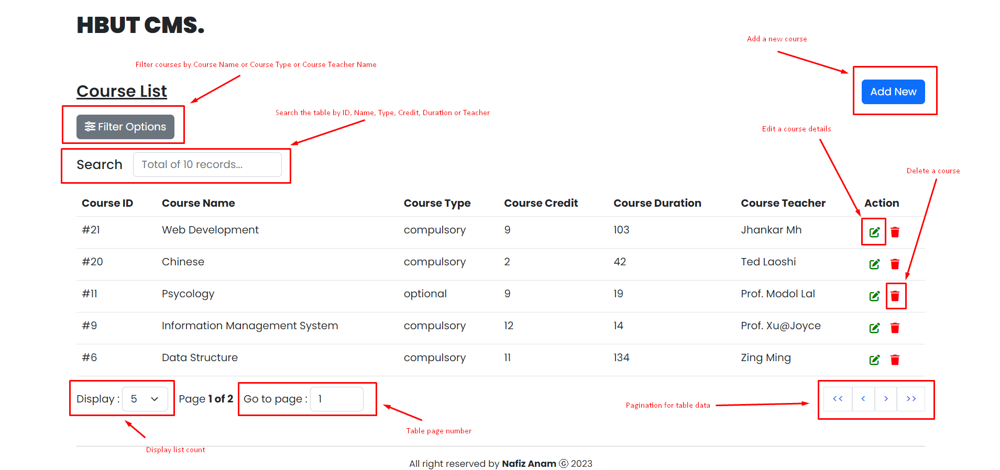
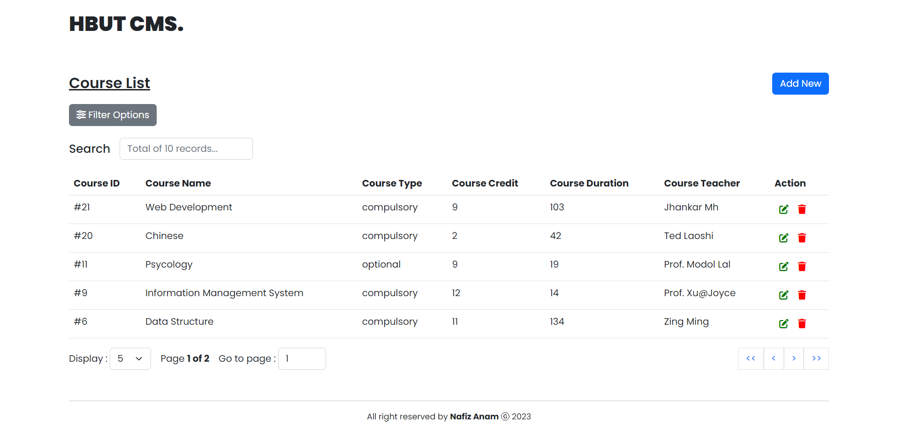
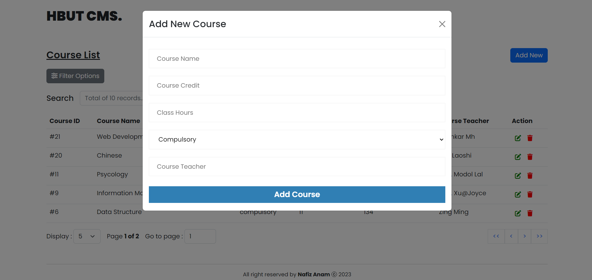
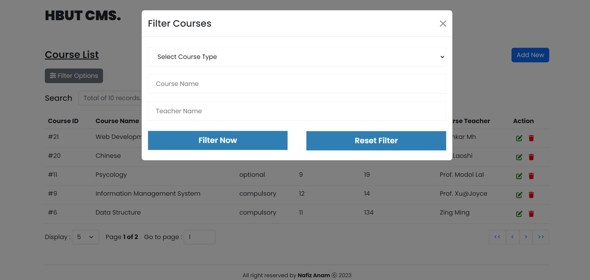

# HBUT_CMS (Course Management System). (frontend)

**HBUT_CMS.** is a full feature Online online Course Management system.

## Live

[Click](https://hbut-course-management-system.onrender.com/) or visit here: https://hbut-course-management-system.onrender.com/

## Live API

[Click](https://hbut-course-management-api.onrender.com) or visit here: https://hbut-course-management-api.onrender.com

## Tech Stack

**Client:** ReactJS, React-Hook-Form, Axios, Bootstrap

## Frontend Features

-   Unique Design and Interactive UI
-   Reusable component used for layout and forms
-   Dynamic table
    -   Search table data
    -   sort table data
    -   Table data pagination
    -   Edit/Delete option
    -   Add New billing option
-   Simple 1 page web app
-   Realistic Header,Footer



## API Features

-   CRUD operation
-   All simple routes
-   Used MySQL for storage of data








## Run Locally

Clone the Project

```bash
  git clone https://github.com/Nafiz-Anam/hbut_cms_client
```

Go to the project directory

```bash
  cd hbut_cms_client
```

Install dependencies

```bash
  npm install
```

Start the server

```bash
  npm run start
```

## Authors

-   [Nafiz Anam](https://nafizanam.com/)
